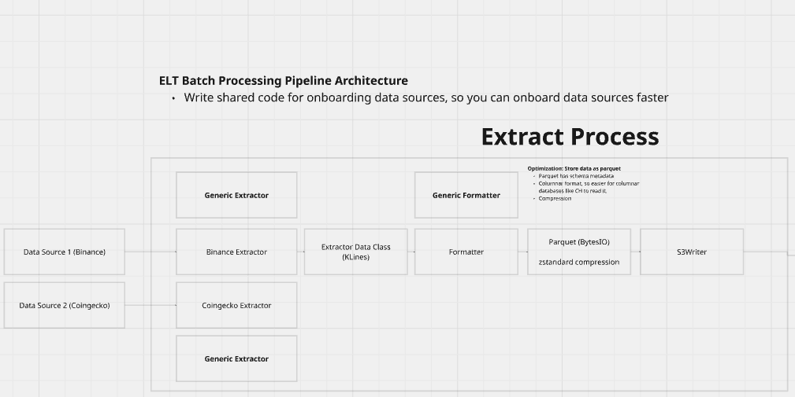
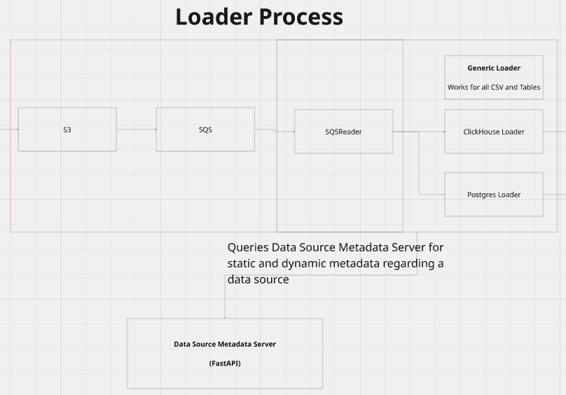
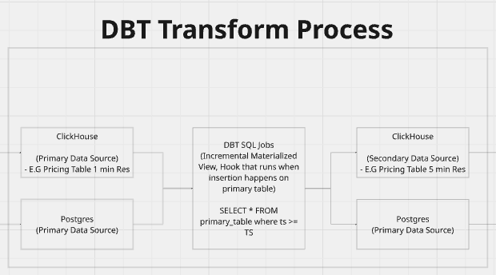
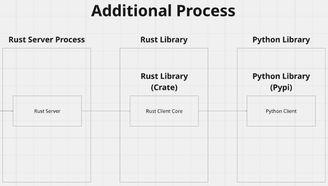

# Binance Pipeline

This project extracts and streams (in progress)

1. OrderBook information
2. KLines Candlestick Data for OCHLV data for trading pairs.

## MIRO Architecture

Below is the ELT architecture:





## Binance Rate Limits & Resolution

Binance has the following rate limits:
1. Hard-limits
2. ML (Machine Learning) Limits
3. WAF (Web Application Firewall) Limits

Hard Limit is the limit which will be applicable for the project thus far with the following info
- 6,000 request weight per minute (keep in mind that this is not necessarily the same as 6,000 requests)
- 100 orders per 10 seconds
- 200,000 orders per 24 hours

[Source](https://www.binance.com/en/support/faq/detail/360004492232)

[Klines weight](https://developers.binance.com/docs/derivatives/usds-margined-futures/market-data/rest-api/Kline-Candlestick-Data): 5 for default 500 rows at a time 

[Klines Resolution](https://developers.binance.com/docs/binance-spot-api-docs/rest-api/market-data-endpoints#klinecandlestick-data): 1s

Note: To get exchange info for klines info, [ExchangeInfo API](https://developers.binance.com/docs/derivatives/option/market-data/Exchange-Information#api-description) is being used too

## Websocket Limits
- WebsSocket connections have a limit of 5 incoming messages per second where each message is considered a PING frame, PONG frame, or JSON controlled message(e.g subscribe, unsubscribe)
- Connection tha goes beyond limit will be disconnected and repeated disconnections may be banned by IP address
- A single connection can listen to a max of 1024 streams
- 300 connections per attempt every 5 minutes per IP -> approx. 1 connection per second

Source: [Binance Stream Docs](https://developers.binance.com/docs/binance-spot-api-docs/web-socket-streams)

### Potential Questions to consider

QQ: For 1 trading pair, how many API requests do you need to get 1 minute resolution data, for start of data 2024 and to get the data in a reasonable amount of time, let's say 3 days.

Start: 1 January 2024

End: 1 June 2025

365 + (365/2) = 547.5 days

547.5 * 24 * 60 = 788,400 minutes

Assuming sticking with a default limit of 500, number of requests = 788400 / 500 = 1577 requests.

QQ: Will it be possible to all 1577 requests within a max of 3 days?

We have 20 requests per second for Klines

Time taken to ingest in seconds = 1577 / 20 requests per second = 79 seconds

Hence, the ETL pipeline will be the limiting factor.


## Project Structure

1. ClickHouse SQL DDL Commands

2. Extractors
3. Service Level Data Classes
4. Database Level Data Classes (DTO)

## Project Setup

### 1. Install ClickHouse 25.5 and run locally

Follow the instructions [here for MacOS](https://clickhouse.com/docs/install)

Install with Brew

```commandline
brew install --cask clickhouse
```

Check if ClickHouse was installed successfully. If installed successfully, there should be a path to where ClickHouse was installed.

```commandline
which clickhouse
```

```commandline
clickhouse server
```

To connect to Local ClickHouse on Port 9000

```commandline
clickhouse client
```

### 2. Setup LocalStack for S3 and SQS Testing

This project uses LocalStack to provide local AWS services (S3 and SQS) for development and testing.

#### Start LocalStack Services

Use Docker Compose to start LocalStack with S3 and SQS services:

```bash
docker-compose -f docker-compose.yml up
```

This will start:
- **LocalStack Gateway** on `localhost:4566` (for AWS API calls)
- **MinIO Web UI** on `localhost:9001` (for visual S3 management)

#### MinIO Web UI Access

Once both services are running, you can access the MinIO web interface at:
```
http://localhost:9001
```

Login credentials:
- **Username:** minioadmin
- **Password:** minioadmin

The MinIO UI allows you to:
- Browse S3 buckets and objects visually
- Upload and download files
- Manage bucket policies and settings
- Monitor storage usage

Note: The MinIO UI connects to LocalStack's S3 service, providing a visual interface for the LocalStack S3 backend.

#### Configure AWS CLI for LocalStack

To interact with LocalStack using AWS CLI:

```bash
# Configure AWS CLI to point to LocalStack
aws configure set aws_access_key_id test
aws configure set aws_secret_access_key test
aws configure set region us-east-1

# Create a test bucket
aws --endpoint-url=http://localhost:4566 s3 mb s3://test-bucket

# List buckets
aws --endpoint-url=http://localhost:4566 s3 ls
```

#### Integration Testing

The integration tests use environment variables to configure boto3 for LocalStack. Set these environment variables before running tests:

```bash
# Configure boto3 to use LocalStack via environment variables
export AWS_ENDPOINT_URL=http://localhost:4566
export AWS_ACCESS_KEY_ID=test
export AWS_SECRET_ACCESS_KEY=test
export AWS_DEFAULT_REGION=us-east-1
```

Run integration tests with:
```bash
# Make sure LocalStack is running first
docker-compose up -d

# Set environment variables and run tests
export AWS_ENDPOINT_URL=http://localhost:4566
export AWS_ACCESS_KEY_ID=test
export AWS_SECRET_ACCESS_KEY=test
export AWS_DEFAULT_REGION=us-east-1
PYTHONPATH=. python -m pytest integration_tests/ -v
```

### 3. Verify S3 and SQS Setup

After starting LocalStack with `docker-compose up`, you can verify that the S3 bucket, SQS queue, and notification configuration are properly set up:

#### Verify S3 Bucket Exists

```bash
# List all buckets
aws --endpoint-url=http://localhost:4566 s3 ls

# Check if crypto bucket exists specifically
aws --endpoint-url=http://localhost:4566 s3 ls s3://crypto
```

#### Verify SQS Queue Exists

```bash
# List all queues
aws --endpoint-url=http://localhost:4566 sqs list-queues

# Get queue URL for klines-notifications
aws --endpoint-url=http://localhost:4566 sqs get-queue-url --queue-name klines-notifications
```

#### Verify Bucket Notification Configuration

```bash
# Get the notification configuration for the crypto bucket
aws --endpoint-url=http://localhost:4566 s3api get-bucket-notification-configuration --bucket crypto
```

This should return a JSON response showing the S3 to SQS notification setup:
```json
{
    "QueueConfigurations": [
        {
            "Id": "klines-parquet-notification",
            "QueueArn": "arn:aws:sqs:us-east-1:000000000000:klines-notifications",
            "Events": ["s3:ObjectCreated:*"],
            "Filter": {
                "Key": {
                    "FilterRules": [
                        {
                            "Name": "prefix",
                            "Value": "data_sources/klines_pricing/btcusd/"
                        },
                        {
                            "Name": "suffix", 
                            "Value": ".parquet"
                        }
                    ]
                }
            }
        }
    ]
}
```

#### Test the Notification System

To test that S3 notifications are working and get a real notification with file path information:

```bash
# Set AWS credentials for LocalStack
export AWS_ACCESS_KEY_ID=test
export AWS_SECRET_ACCESS_KEY=test
export AWS_DEFAULT_REGION=us-east-1

# Create a test parquet file
echo "test data" > test.parquet

# Upload to the monitored path (this triggers the notification)
aws --endpoint-url=http://localhost:4566 s3 cp test.parquet s3://crypto/data_sources/klines_pricing/btcusd/test.parquet

# Check for the notification message
aws --endpoint-url=http://localhost:4566 sqs receive-message --queue-url http://localhost:4566/000000000000/klines-notifications

# Clean up test file
aws --endpoint-url=http://localhost:4566 s3 rm s3://crypto/data_sources/klines_pricing/btcusd/test.parquet
rm test.parquet
```

If the notification system is working, you should see a message in the SQS queue containing details about the uploaded file. The real notification will include the file path in the `s3.object.key` field:

```json
{ 
  "Records": [{
    "eventName": "ObjectCreated:Put",
    "s3": {
      "bucket": {"name": "crypto"},
      "object": {
        "key": "data_sources/klines_pricing/btcusd/test.parquet",
        "size": 18
      }
    }
  }]
}
```

Note: You may also see test events that don't contain file information - these are just configuration validation events from LocalStack.

Or create a `.env` file with:
```bash
AWS_ENDPOINT_URL=http://localhost:4566
AWS_ACCESS_KEY_ID=test
AWS_SECRET_ACCESS_KEY=test
AWS_DEFAULT_REGION=us-east-1
```

<details>

<summary>Approach 2: Download the Binary and Run</summary>

Linux: Download [`clickhouse-common-static-25.5.3.75-amd64.tgz`](https://github.com/ClickHouse/ClickHouse/releases/download/v25.5.3.75-stable/clickhouse-common-static-25.5.3.75-amd64.tgz) from ClickHouse Github

Extract the zip to get both the client and server source code

```commandline
tar -xzf clickhouse-common-static-25.5.3.75-amd64
cd clickhouse-common-static-25.5.3.75-amd64
```

Spin up ClickHouse on (HTTP) Port 8123 and (Native SQL Protocol) Port 9000

```commandline
./bin/usr/clickhouse server
```

## Testing

### Unit Tests
```bash
# Run all unit tests
poetry run pytest tests/

# Run specific test modules
poetry run pytest tests/unit/
```

### Integration Tests

Integration tests require running services (ClickHouse, LocalStack, etc.) and proper environment configuration.

#### Prerequisites
1. **Start Docker Services**:
   ```bash
   docker-compose up -d
   ```

2. **Configure Environment Variables**:
   ```bash
   # Export ClickHouse credentials for integration tests
   export CLICKHOUSE_HOST=localhost
   export CLICKHOUSE_PORT=8123
   export CLICKHOUSE_USERNAME=default
   export CLICKHOUSE_PASSWORD=password
   export CLICKHOUSE_DATABASE=default
   
   # Optional: Export other service credentials
   export AWS_ACCESS_KEY_ID=test
   export AWS_SECRET_ACCESS_KEY=test
   export AWS_DEFAULT_REGION=us-east-1
   export AWS_ENDPOINT_URL=http://localhost:4566
   ```

3. **Verify Services Are Running**:
   ```bash
   # Check ClickHouse
   curl -u default:password http://localhost:8123/ping
   # Should return: Ok.
   
   # Check LocalStack
   curl http://localhost:4566/health
   # Should return health status
   ```

#### Running Integration Tests

```bash
# Run all integration tests
CLICKHOUSE_PASSWORD=password poetry run pytest integration_tests/ -v

# Run specific integration test suites
CLICKHOUSE_PASSWORD=password poetry run pytest integration_tests/src/loader_process/loaders/ -v

# Run with verbose output for debugging
CLICKHOUSE_PASSWORD=password poetry run pytest integration_tests/src/loader_process/loaders/test_clickhouse_loader.py -vvv
```

#### ClickHouse Integration Tests

The ClickHouse loader integration tests validate:
- **End-to-end data pipeline**: Binary Parquet → PyArrow Table → ClickHouse
- **Table operations**: Temporary tables, append-only tables, ReplacingMergeTree
- **Data deduplication**: Materialized views and ReplacingMergeTree functionality
- **Error handling**: Invalid data, schema mismatches, connection issues
- **Resource cleanup**: Automatic cleanup of temporary tables

Test coverage includes:
- `test_clickhouse_loader_integration`: Full pipeline with deduplication verification
- `test_loader_error_handling`: Error scenarios with invalid parquet data
- `test_loader_schema_validation`: Schema mismatch detection

#### Troubleshooting Integration Tests

**Connection Issues (Error 516)**:
```bash
# Restart ClickHouse if authentication fails
docker-compose restart clickhouse

# Check ClickHouse logs
docker-compose logs clickhouse

# Verify credentials work
curl -u default:password http://localhost:8123 -d "SELECT 1"
```

**Table Creation Issues**:
```bash
# Clean up any leftover test tables
docker exec clickhouse clickhouse-client --query "DROP TABLE IF EXISTS test_crypto_prices_temp"
docker exec clickhouse clickhouse-client --query "DROP TABLE IF EXISTS test_crypto_prices_append_only"
```

**Port Conflicts**:
- ClickHouse HTTP: `localhost:8123`
- ClickHouse Native: `localhost:9000`
- LocalStack: `localhost:4566`
- MinIO Console: `localhost:9001`

### Running All Tests
```bash
# Run both unit and integration tests
export CLICKHOUSE_PASSWORD=password
poetry run pytest tests/ integration_tests/ -v
```     

### Docker-compose explanation

```txt
              /-> (minio)
(localstack)  
              \-> (setup-s3-notifications)

(clickhouse) -> (clickhouse-init)
```
</details>

## To Spin up the Project
### 1. Make sure there is not cached items before spinning up your docker containers

```commandline
docker compose build --no-cache
docker compose up --build
```

### To tear down your project after
```commandline
docker compose down
```


